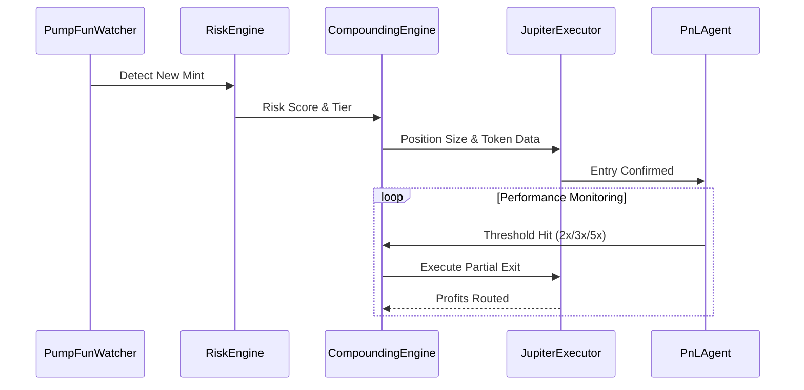

# System Flow

This document outlines the operational flow of the Solana Meme Compounder agents.

## Agent Flow
1. **PumpFunWatcher detects mint**: Monitors the Solana blockchain for new token mints on Pump.fun.
2. **RiskEngine scores token**: Analyzes dev behavior, liquidity, and early buyer clustering to assign a risk score and tier.
3. **CompoundingEngine determines position size**: Uses the risk score and conviction to calculate the appropriate entry size.
4. **JupiterExecutor executes entry**: Fetches quotes and executes the swap through Jupiter.
5. **PnLAgent tracks performance**: Monitors realized and unrealized PnL, emitting events at profit thresholds (2x, 3x, 5x).
6. **CompoundingEngine routes profits**: Handles partial exits and reallocates capital according to the compounding strategy.
7. **System loops**: The cycle repeats for new opportunities.

## Sequence Diagram

